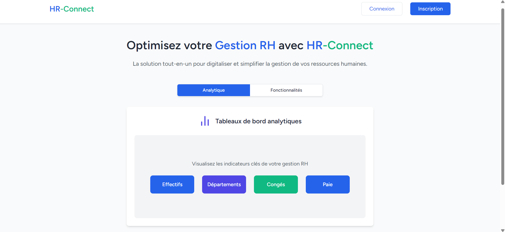
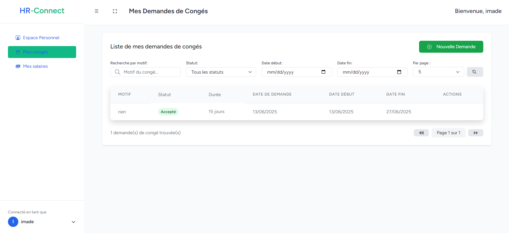
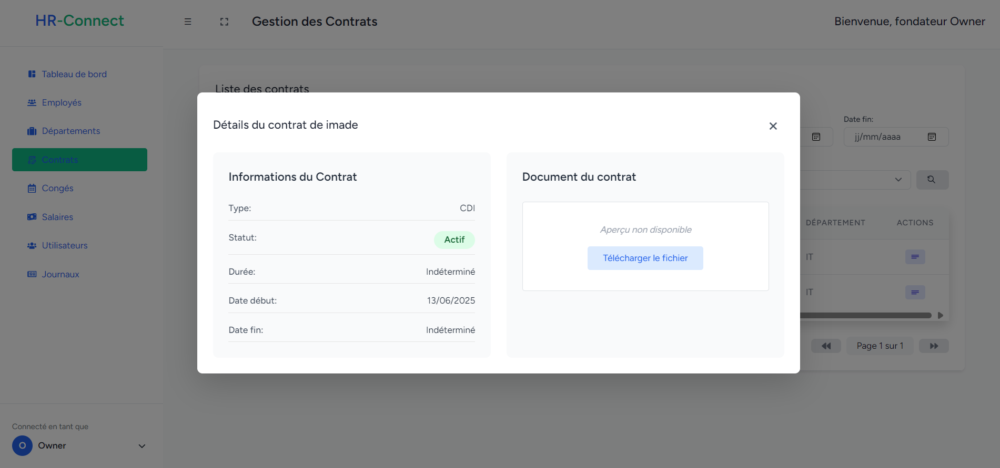
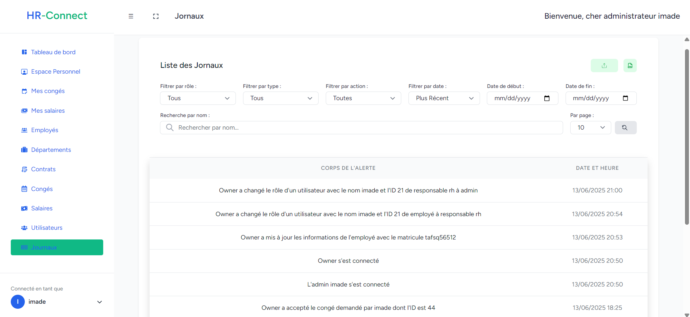
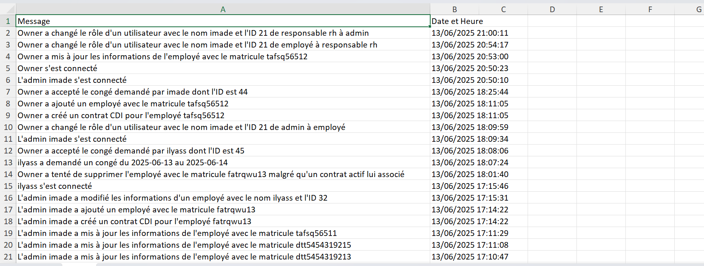
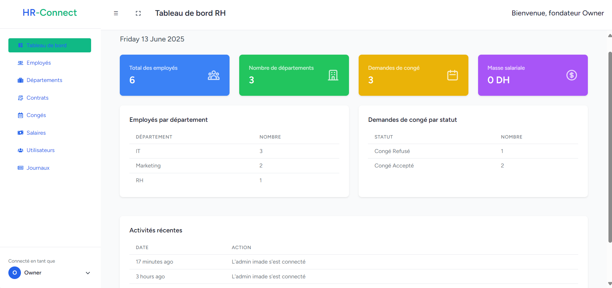

## 📍 HR-Connect – Application Web de Gestion des Ressources Humaines pour PME  

HR-Connect est une application web complète développée avec **Laravel (backend)** et **React (frontend)**.  
Elle permet de gérer les ressources humaines pour les entreprises petites et moyennes, avec un **système de gestion avancée des congés, contrats, salaires, journaux d’activité, départements et employés**, ainsi qu’une **gestion des utilisateurs selon les rôles**.  

> 🗓 Projet développé en **2025** comme projet full-stack professionnel.  

---

## ✨ Fonctionnalités principales  

- Dashboard affichant toutes les statistiques clés de l’application.  
- Gestion des employés par département avec contrôle précis des droits d’accès.  
- Système de rôles et permissions :  
  - **Super Admin (Founder)** : gestion complète de l’application, y compris création des comptes admin.  
  - **Admin** : gestion des employés, congés, contrats, départements, utilisateurs et consultation des journaux d’activité.  
  - **Manager (Super utilisateur)** : gestion des employés, congés, contrats et départements.  
  - **Utilisateur** : consultation de son espace personnel (informations contrat, salaires, informations personnelles).  
- Filtrage dynamique et exportation des données.  
- API **RESTful** sécurisée pour la communication backend/frontend.  
- Authentification sécurisée avec gestion des sessions.  
- Interface réactive et moderne en **React.js** pour une meilleure expérience utilisateur.  

---

## 🚀 Installation  

### 🔧 Prérequis  
- PHP 8.1 ou supérieur  
- Composer  
- MySQL  
- Node.js et NPM  
- Tailwind CSS  

### ⚙️ Étapes d’installation  

1. **Cloner le dépôt**  
```bash
git clone https://github.com/aymennnb/hr-connect
cd hr-connect
```

2. **Installer les dépendances**
```bash
composer install
npm install
npm run build
```

3. **Configurer l'environnement**
```bash
cp .env.example .env
php artisan key:generate
```

4. **Configurer la base de données dans le fichier .env**
```bash
DB_CONNECTION=mysql
DB_HOST=127.0.0.1
DB_PORT=3306
DB_DATABASE=nom_de_votre_base
DB_USERNAME=utilisateur
DB_PASSWORD=mot_de_passe
```

5. **Exécuter les migrations et seeders**
```bash
php artisan migrate --seed
```

6. **Lancer l'application**
```bash
php artisan serve
```

## 🧰 Technologies utilisées

- **Framework:** Laravel 10.x
- **Base de données:** MySQL
- **Frontend:** React

## 📸 Aperçu













👨‍💻 **Auteur**  
Développé par **Nabaoui Aymen**.  